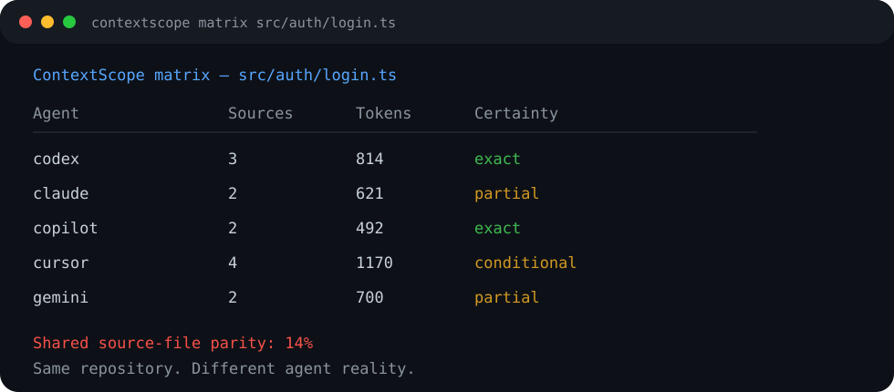

<div align="center">

# ContextScope

### See the instructions your coding agents actually see.

**Codex · Claude Code · GitHub Copilot · Cursor · Gemini CLI**

[](https://github.com/Dean00dev/ContextScope/actions/workflows/ci.yml)
[](LICENSE)
[](package.json)

</div>

<p align="center"></p>

Coding agents can share a repository without sharing the same repository-provided instructions.

A root `AGENTS.md`, nested override, `CLAUDE.md`, `GEMINI.md`, Copilot path rule and Cursor `.mdc` file can all produce different effective context for the **same source file**. ContextScope makes that difference visible before it becomes a mysterious agent-behaviour problem.

```text
$ contextscope matrix src/auth/login.ts

ContextScope matrix — src/auth/login.ts

Agent        Sources  Tokens   Certainty
----------------------------------------------
codex        3        814      exact
claude       2        621      partial
copilot      2        492      exact
cursor       4        1170     conditional
gemini       2        700      partial

Shared source-file parity: 14%
```

## Why this exists

Agent instructions are becoming repository infrastructure, but their discovery rules are fragmented across tools. A change in one instruction file can affect one agent, one directory, one file type, or an entire repository while leaving another agent untouched.

ContextScope answers a deliberately narrow question:

> **For this repository path, what repository-provided instruction sources can we prove this agent receives — and where do agents diverge?**

It is offline, model-agnostic, zero-runtime-dependency, and explicit about uncertainty. If a rule is agent-requested or a tool's runtime discovery cannot be reproduced statically, ContextScope says **conditional** or **partial** instead of inventing certainty.

## Install

Node.js 20+ and Git are required.

```bash
npm install --global github:Dean00dev/ContextScope
```

Or run directly from a clone:

```bash
git clone https://github.com/Dean00dev/ContextScope.git
cd ContextScope
node src/cli.js doctor
```

## Commands

### Explain one agent

```bash
contextscope explain src/auth/login.ts --agent codex
contextscope explain src/auth/login.ts --agent claude
contextscope explain src/auth/login.ts --agent copilot
contextscope explain src/auth/login.ts --agent cursor
contextscope explain src/auth/login.ts --agent gemini
```

Shows applied files in load order, conditional rules, missing imports, approximate context size, and the certainty of the reconstruction.

### Compare every supported agent

```bash
contextscope matrix src/auth/login.ts
```

### Diff two agents

```bash
contextscope diff src/auth/login.ts --agent codex --agent claude
```

ContextScope compares normalized instruction lines. It intentionally does **not** claim semantic equivalence between differently worded instructions.

### Scan the repository

```bash
contextscope scan
contextscope scan --format json
contextscope scan --format sarif --output contextscope.sarif
contextscope scan --format junit --output contextscope.junit.xml
contextscope scan --fail-on-warning
```

The scanner inventories instruction surfaces and currently detects missing repository-local `@` references, references that escape the repository, duplicated exact instruction lines, and multi-agent instruction surfaces.

## GitHub Action

```yaml
name: ContextScope
on:
  pull_request:
  push:
    branches: [main]

permissions:
  contents: read

jobs:
  contextscope:
    runs-on: ubuntu-latest
    steps:
      - uses: actions/checkout@v4
      - uses: Dean00dev/ContextScope@v0.1.0
        with:
          fail_on_warning: false
      - uses: actions/upload-artifact@v4
        if: always()
        with:
          name: contextscope-report
          path: contextscope-report/
```

The Action writes Markdown, JSON, SARIF and JUnit evidence. Command/model output is not involved because ContextScope does not call a model.

## Supported instruction surfaces in v0.1

| Agent | Repository surfaces | Static certainty |
| --- | --- | --- |
| Codex | `AGENTS.md`, `AGENTS.override.md` from repository root to target directory | **Exact** for repository scope |
| Claude Code | root-to-target `CLAUDE.md` chain + repository-local `@imports` (5 hops) | **Partial** |
| GitHub Copilot | `.github/copilot-instructions.md` + matching `.github/instructions/**/*.instructions.md` | **Exact** for these surfaces |
| Cursor | `.cursor/rules/**/*.mdc`, always/target-glob rules, legacy `.cursorrules` | **Conditional** for agent-requested/manual rules |
| Gemini CLI | root-to-target `GEMINI.md` chain + repository-local imports | **Partial** because Gemini also performs broader descendant discovery |

See [Semantics and limits](docs/SEMANTICS.md) for the exact claims and source links.

## What ContextScope does **not** claim

ContextScope does not inspect hidden system prompts, personal/global instruction files, conversation history, model memory, runtime tool selection, or whether a model actually obeyed an instruction. It reconstructs **repository-provided instruction surfaces** using documented discovery rules and marks incomplete/conditional cases as such.

That boundary is a feature, not fine print.

## Roadmap

- **v0.1** — path explain/matrix/diff, repository scan, five agent profiles, Action, JSON/SARIF/JUnit.
- **v0.2** — PR impact analysis: “this instruction change alters effective context for N paths.”
- **v0.3** — repository parity policies, baselines, allowlists and drift budgets.
- **v0.4** — machine-readable provenance graph and editor integrations.

See [ROADMAP.md](docs/ROADMAP.md).

## Design doctrine

1. **Documented beats guessed.**
2. **Repository evidence beats model vibes.**
3. **Conditional stays conditional.**
4. **No model/API dependency for a static repository question.**
5. **A green report is bounded evidence, not certification.**

## License

MIT. See [LICENSE](LICENSE).
